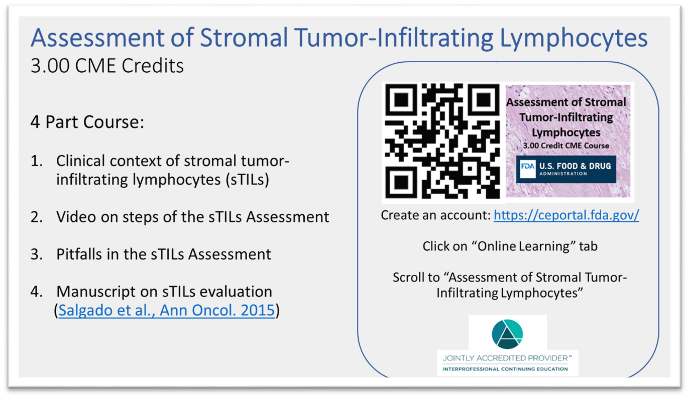

## August 2023

* New HTT project website was launched: [https://didsr.github.io/HTT.home](https://didsr.github.io/HTT.home)

    * The NCI is decomissioning the hub where we have been sharing our work and collaborating since 2017. So sad.
    
    * The transition from our [legacy hub group](https://ncihub.cancer.gov/groups/eedapstudies) is a work in progress.

* Manuscript in production: *Initial Interactions with the FDA on Developing a Validation Dataset as a Medical Device Development Tool* - **Journal of Pathology**

    * Steven Hart (Department of Laboratory Medicine and Pathology, Mayo Clinic), et al.

    * Link will be added here!
    
* Contract awarded to Yale University to collect pathologist annotations on the eeDAP microscope system.

    * eeDAP: evaluation environment for digital and analog pathology [https://www.doi.org/10.1117/1.JMI.1.3.037501](https://www.doi.org/10.1117/1.JMI.1.3.037501)
    
    * If you are near to Yale (New Haven, CT), email [kim.blenman@yale.edu](mailto:kim.blenman@yale.edu) to find out more. Your time will be compensated. 
    
    
    
## July 2023

* 5-year funding award won: Burroughs Wellcome Fund *Innovation in Regulatory Sciences*

    * Title: "Development of optical and digital microscopy hardware, software, and statistical methods to enable assessment of computational pathology"
    
    * PI: Dr. Kim Blenman (Yale University)
    
    * co-Investigator: Dr. Brandon Gallas (FDA/CDRH/OSEL/DIDSR)

## June 2023

* We have launched our pivotal study!

    * 5 batches of 8 slides curated - 10 ROIs per image - 400 ROIs.
    
    * Please share and post [this recruiting flyer](../assets/pages/pivotal-study/pdfs-images/recruitReadersFlyer-2023.pdf).
    
* We have launched our interactive training modules.

    * Here is the link with information and instructions to get started on the interactive training [LINK](../assets/pages/training-2023/interactiveTraining-gettingStarted.html)
    
    * There are two interactive training tests: a Feedback Test (optional: 30-60 minutes) and a Proficiency Test (required: 30-60 minutes). 
    
    * After completing either interactive training test, performance test report will be compiled and shared with the user.
    
    * Here are example test reports: [testReport-example-feedback.pdf](../assets/pages/training-2023/pdfs/testReport-example-feedback1.pdf) and [testReport-example-proficiency.pdf](../assets/pages/training-2023/pdfs/testReport-example-proficiency1.pdf)

## March 2023

* Sourced and scanned 38 more H&E slides of TNBC core biopsies. Total 124!

    * We have 32 more slides that have not been scanned yet. Total 156!

* Launch FDA-hosted online continuing medical education (CME) course

    * [https://ceportal.fda.gov/](https://ceportal.fda.gov/)
    

## February 2023

* Presentation and proceedings paper for the SPIE Medical Imaging Conference

    * Title: *Analysis of a pilot study collecting pathologist annotations for validating machine learning algorithms*
    
    * Author: Katherine Elfer (FDA/CDRH/OSEL/DIDSR), et al.
    
    * Slides available on request.
    

## January 2023

* FDA-Yale Research Collaboration Agreement fully executed.

    * This is site #3 for slide sourcing.
    
    * PI: Dr. Kim Blenman (Yale University)
    
    * PI: Dr. Brandon Gallas (FDA/CDRH/OSEL/DIDSR)

* New research assistant added to the FDA team. Emma Gardecki.

## December 2022

* Poster presented at the San Antonio Breast Cancer Symposium.

    * Title: *Educating pathologists in quantitating stromal tumor-infiltrating lymphocytes in breast cancer for artificial intelligence applications*
    
    * Author: Amy Ly, (Department of Pathology, Massachusetts General Hospital), et al. 
    
    * Poster available on request.
    
    
    
