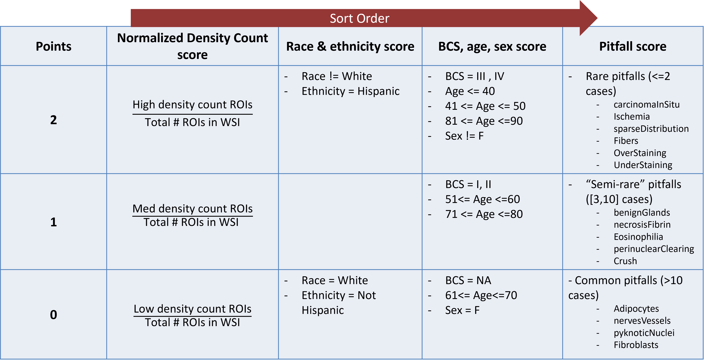

# Clinical Context 
The annotations we are collecting are estimates of the density of stromal tumor-infiltrating lymphocytes (sTILs) in breast cancer. sTILs are a prognostic biomarker ([Salgado2015_Ann-Oncol_v26p259](https://doi.org/10.1093/annonc/mdu450), [Loi2019_J-Clin-Oncol_v37p559](https://doi.org/10.1200/jco.18.01010)). While sTILs have shown prognostic value for many different types cancer, our project's use case focuses on triple negative breast cancer (TNBC).  

# What we Collect
## Sourcing
We currently collect data from 2 collaborating academic medical centers:  
- Stony Brook Hospital (NY, USA)  
- Emory Hospital (GA, USA)  

We are still looking for a third U.S. site to help us source a diverse set of H&E TNBC slides. Please [contact our team](./team.md) if you think your institution could help.

## Inclusion and Exclusion criteria
**Inclusion Criteria**
- Core biopsies of triple negative breast cancer (TNBC: ER/PR/HER2 negative)  
- Slides that have been stained with hematoxylin and eosin (H&E) within the last 7 years  

**Exclusion Criteria**
- Tissue collected after administration of any therapy (e.g., neoadjuvant, chemotherapy, radiation therapy)  

**Required Metadata**
We have mapped the metadata fields to the NAACCR (North American Association of Central Cancer Registries) separately. Please ask for these if needed.  

| **Feature**	| **Description** | **Expected Value** | 
| **Age** | Age of patient at time of sample acquisition. If patient is >89 years of age, Age is reported as 90. | ## |
| **Sex** | Patient's sex. | Female |
|     |                | Male   |
| **Race** | Patient's race. More than one response is allowed. | American Indian or Alaska Native |
|      |    | Asian |
|      |    | Black or African American |
|      |    | Native Hawaiian or Other Pacific Islander |
|      |    | White |
| **Ethnicity** | Patient's ethnicity | Hispanic or Latino |
|           |                     | Not Hispanic or Latino |
| **Breast Cancer Stage** | Denotes breast cancer stage at time of biopsy. | 0 |
|    |  | I |
|    |  | II |
|    |  | III |
|    |  | IV |
| **WSI Image Resolution** | How much slide area is captured in 1 pixel, described as micrometers/pixel or microns per pixel (mpp). | ## |
| **WSI Scanner Make** | Manufacturer name of the WSI scanner. | (Character string) |
| **WSI Scanner Model** | Model of WSI scanner used. | (Character string) |
| **WSI Numerical Aperture** | Aperture diameter of microscope lens used during image acquisition. Reported in millimeters (mm). | ## |
| **WSI Objective Magnification** | Magnification of microscope objective lens used during image acquisition. Reported as a multiplier (##X). | ## |
| **Specimen Collection Site** | Site where the tissue was collected. | (Character string) |
| **Slide Preparation Site** | Site where slides were prepared. | (Character string) |
| **Slide Scanning Site** | Site where slides were scanned. | (Character string) |

**Optional Metadata**
The metadata is a “wish list”, and we recognize that each institution has different processes and data to share.

| **Feature** | **Description** | **Expected Values** |
| **Tumor size (cm)** | Size of tumor in image as measured in centimeters. | ## |
| **TNM Stage** | Denotes clinical tumor staging at time of biopsy. | T(0-4)N(0-3)M(0-1) |
| **Histologic subtypes** | The histologic classification of breast cancer type. | Ductal, NOS |
|        |       | Lobular | 
|        |       | Tubular |
|        |       | Cribriform |
|        |       | Mucinous |
|        |       | Micropapillary |
|        |       | Apocrine |
|        |       | Metaplastic |
|        |       | Adenoid cystic |
|        |       | Other |
| **Nottingham Grade** | Histologic grade determined by degree of tubule formation, nuclear pleomorphism, and mitotic activity. | I (well-differentiated) |
|   |   | II (moderately differentiated) |
|   |   | III (poorly differentiated) |
| **Mitosis (/10HPF)** | Count of number of mitosis in 10 high powered field (40X magnification) or per unit area (2 mm^2) in the most active part of the tumor. | 1 (0-6 mitosis/2 mm^2) |
|   |   | 2 (7-12 mitosis/2 mm^2) |
|   |   | 3 (12 mitosis or more/2 mm^2) |
| **Nuclear Grade** | Degree of nuclear pleomorphism in tissue sampled including nucleus size, shape, and uniformity. | 1 (small, regular uniform cells) |
|   |   | 2 (moderate increase in size and variability) |
|   |   | 3 (marked variation) |
| **Tubule Formation** | Proportion of tumor displaying tubular structure. | 1 (majority of tumor, > 75%) |
|   |   | 2 (moderate degree, 10-75%) |
|   |   | 3 (little or none, <10%) |
| **BRCA Mutation** | Patient with either positive BRCA1 or BRCA2 mutation as detected by germline testing. Optional. | BRCA1 |
|   |  | BRCA2 |
|   |  | Negative |
|   |  | N/A (Test not performed) |
| **Ki-67 Percentage** | Percentage of cells that are Ki-67 positive. Optional. | ## |
|   |  | N/A (Stain not performed) |
| **Ki-67 Intensity** | Intensity of Immunohistochemistry (IHC) stain. Optional. | 1+ (Weak positive staining) |
|   |  | 2+ (Moderate positive staining) |
|   |  | 3+ (Strong positive staining) |
|   |  | N/A (Stain not performed) |
| **Ki-67 Stain Manufacturer** | Manufacturer of Ki-67 stain. | (Character string) |
| **PD-L1 Combined Composite Score** | The percentage of PD-L1+ cells (tumor cells, lymphocytes, macrophages) to the total number of tumor cells. | ## |
| **PD-L1 Combined Composite Score Test** | What companion diagnostic test was used to determine the PD-L1 Combined Composite Score. | (Character string) |

## Case Prioritization

We used a hierarchical score-sort method to prioritize cases with less common data for Pivotal study annotation.  By doing this, we are enrich the dataset in line with our regulatory objectives.  

