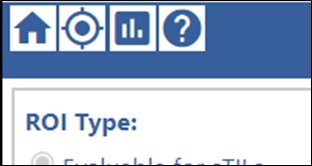

## Goal of ROI selection

The overarching goal of ROI selection is to perform a first pass assessment of an image to identify and annotate 10 ROIs for multiple future pathologists to evaluate.  The first-pass ROIs and annotations of each image are summarized and used to prioritize images for the pivotal study. We prioritize images with the least common demographic and pathologic metadata.  More information on the batch selection method is available by request. 

# Platform Instructions

1. From the Collection List, select an ROI selection collection by clicking on the blue button labeled "ROI Selection". 

2. Once in the collection, **click "Select ROIs" to begin selecting ROIs for sTILs evaluation.** The number of ROIs already existing on a slide may vary and your "ROIs" column will update as you complete the task. If you want to review the ROIs already selected for an image, click "Review".

3. To move around the WSI: Use your machine’s **pan and zoom** actions or adjust the magnification and location using the image navigator controls in the bottom right. 

4. To select an ROI:  **Double-click** a location to create or reposition an ROI.
    
    **a.** The location of your click will be the center of the new ROI.  

    **b.** We recommend **all annotations be made using 20x magnification.**

    **c.** If you don't like the location of the ROI, double-click to reset the position. Annotation data will be reset. 

5. Click **"Save & Next"** to save the ROI and corresponding annotation. You can then create a new ROI on the WSI or exit the image using the "Quit" button.
    
    **a.** **Once an ROI has been saved, it cannot be deleted.** If you don't like it, create another. 

**Note:** To help resolve issues, please grab the url of the page that shows an issue and include it in an [email to the project team](../team.md) describing the issue. That will help us to find it quickly and investigate. There is also a “Comment” box to record any issues before you save an annotation.

## ROI Selection Protocol

1. Select **10 ROIs** per WSI. Any tissue in the WSI is eligible for annotation. However, we aim to create a diverse set of ROIs which contains both anomalies, such as pitfalls and artifacts, as well as high-value sTILs densities. Therefore: **target diverse morphology and sTILs density** (especially high sTILs density) while distributing ROIs across entire tissue. Each ROI can satisfy multiple targets. Not all targets can be satisfied in each WSI. The numbers to select mentioned below are guides. 

    In each WSI:  

    **a.**  Select 3 ROIs inside tumor with stroma    
            
    &emsp;*(1 ROI should be at least 25% void of tissue)*    

    **b.**  Select 2 ROIs at invasive margin if discernable with stroma   

    &emsp;*(not sure this is possible with biopsies, 1 ROI should be at least 25% void of tissue)*   

    **c.**  Select 2 ROIs inside tumor or at margin **without stroma**

    &emsp;*(not sure there are many or any of these)*    

    **d.**  Select 2 ROIs where there is no proximal tumor   

    &emsp;*(normal tissue: outside 500 μm tumor margin)*

    **e.**  Select 2 ROIs for each for the 16 pitfalls listed. The pitfalls were identified during sessions to understand pathologist variability and improve pathologist training and instructions for the assessment of sTILs [(Garcia2022_Cancers_v14p2467)](https://doi.org/10.3390/cancers14102467). The pitfalls are discussed and exemplified in the [CME course](../training-2023/cmeCourse.md), the test with feedback, and the [reference document](../training-2023/feedbackRefDoc.md).  

2. Provide Annotations on selected ROIs.  HTT sTILs Study Annotations collected:   

	**a.**  ROI Type (Evaluable versus Not Evaluable)

    **b.**  % Tumor-Associated Stroma
	    
    &emsp;**Only for “Evaluable” ROIs.** Input the percent (%) as an integer using either the slide bar or by clicking the % value to the right of the slide bar and typing the value. 
	
    **c.**  sTILs Density 

    &emsp;**Only for “Evaluable” ROIs.** Input the percent (%) as an integer using either the slide bar or by clicking the % value to the right of the slide bar and typing the value. 
	
    **d.**  Tissue Type 
	
    &emsp;If the ROI Type is “Evaluable”, select either “Tumor with Stroma” or “Invasive Margin”.  

	&emsp;If the ROI Type is “Not Evaluable for sTILs”, select either “Inside tumor/ margin with low/ no stroma” or “No Proximal Tumor (within 500 μm)”.  
	
    **e.**  Pitfalls
	
    &emsp;Click the corresponding checkbox of any pitfalls present in the ROI. 
	
    **f.**  Additional Comments
	
    &emsp;Any additional comments about the selected ROI and image can be added in this free-text box.

## Pitfalls

Part 3 of the [CME course slides](../training-2023/pdfs/cmeCourseSlides-combined-final-20230217.pdf) offers visual examples of each type of pitfall you might find.

| benign glandular elements	| cross-sectionally cut fibroblasts | 
| adipocytes | low grade and/or degenerate ischemic tumor cells | 
| carcinoma in situ | crushed cells | 
| necrosis and fibrin | sparsely distributed tumor cells | 
| nerves and/or larger caliber blood vessels | fibers | 
| eosinophilia | folds |  
| small/pyknotic nuclei	| over-staining |  
| perinuclear clearing | under-staining | 

## CaMicroscope Icons

Icon functionality listed in order of left to right:  
    &emsp; **1.** **Home:** Return to list of assigned WSIs and ROIs (Collection List).     
    &emsp; **2.** **ROI Location:** Return to the center of the active ROI. If there is not an active ROI, the browser will alert you with banner message.     
    &emsp; **3.** **TIL Sample:** View the TILs cheat sheet.      
    &emsp; **4.** **ROI Selection Protocol:** View the selection protocol if you need a refresher on anything in this document.          
    