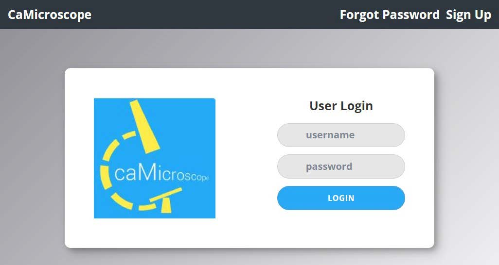

## Create your caMicroscope Account

1. In order to participate in Interactive sTILs Training, the HTT project studies, or ROI Selection on caMicroscope, you will first need to sign up for an account. Go to [https://wolf.cci.emory.edu/camic/htt/](https://wolf.cci.emory.edu/camic/htt/) and click "Sign Up". 

    

2. Please read and accept the Consent Form.

    

3. Please complete the Basic Information, Professional, and Certifications information as appropriate for you. Once the required sections are filled, you can click “Next” and/or “Submit” to move onto the next screen. Screen shots provided below.  

    &emsp; **a.** After entering all the information and hitting submit, the screen may remain unchanged, but the request is being processed. If you click the submit button a second time, you will get an error message because the account is already made.  

    

    

    

4. Within a few minutes, an email will be sent to the email address you registered with (Subject: “caMicroscope : Welcome” from rbirmin@emory.edu). Please make sure to click the “Reset your password” link to be directed to a page to create a password for your account. The link will expire in one hour. If the link has expired, visit the login page and click “Forgot Password” in the top-right corner; another email with a link to reset your password will be sent.

    

5. Once a password is created, you can return to [https://wolf.cci.emory.edu/camic/htt/](https://wolf.cci.emory.edu/camic/htt/) and log in with your credentials. Your username is your email address.  
    &emsp; **a.** The platform starts empty. HTT project organizers need to assign you collections.  
    &emsp; **b.** Response time to your registration should be less than two days but may take longer. Please be patient.
    &emsp; **c.** If you haven’t been contacted after five days, please contact the [project organizers.](../team.md) and explain.  
    &emsp; **d.** Once your registration is processed by the HTT project organizers, you will sent further instructions.  

## How to Access HTT Interactive Training and Pivotal Studies

1. Go to [https://wolf.cci.emory.edu/camic/htt/](https://wolf.cci.emory.edu/camic/htt/). Login to your caMicroscope account with the email address and password you used to register. You will be brought to the landing page. 

    

2. Click the **“COLLECTIONS”** button to find all collections, including the interactive training and pivotal study collections.

    

3. Click the “ROIs Evaluation” to select the collection you would like to complete (example below: “HTT-pivotal-batch001” and “Feedback Test 1”).

    

4. Once in the collection, click **“Annotate”** to open an image and begin the sTILs evaluation on the ROIs within. The number of ROIs on a slide may vary and your “ROIs” column will update as you complete the task.

    

5. Annotate the ROI presented, then click “Save & Next” to save your annotation and move to the next ROI. It may take a moment to move to the next ROI. When you finish annotating all ROIs for a WSI, you will return to the list of cases in step 4. Notes on the annotation:  
    &emsp; **a.** ROI Type: If the ROI is within 1 mm of the tumor (500 𝜇𝜇m of the tumor margin) and includes stroma, it is “Evaluable for sTILs”. Otherwise, it is not.  
    &emsp; **b.** % Tumor-Associated Stroma: The area of tumor-associated stroma divided by the area of the ROI.  
    &emsp; **c.** sTILs Density: The area of the tumor-infiltrating lymphocytes divided by the area of the tumor-associated stroma.  

       

    &emsp; **d.** If you are annotating the “Feedback Test”, you will see feedback from the experts (scores, comments and pitfalls) before moving to the next ROI. Select “Next” to continue.  

    

**Note:** To help resolve issues, please grab the url of the page that shows a problem. That will help us to find it quickly and investigate.  

## Overview of caMicroscope Icons

Icon functionality listed in order of left to right:  
    &emsp; **1.** Return to list of assigned images and ROIs (Collection List)  
    &emsp; **2.** Return to the center of the ROI  
    &emsp; **3.** View the [sTILs calibration reference guide](../training-2023/images/salgado2014-fig4.jpg)  
    &emsp; **4.** View slides of a tutorial presentation on the sTILs assessment from the International Working Group for TIL in breast cancer (2014, adapted 2020)   

## Summary of the Five Steps of the sTILs Assessment

Below are screen shots from the training video that was part of the FDA CME course, “Assessment of Stromal Tumor-Infiltrating Lymphocytes.”

* You can watch the [full video on YouTube](https://www.youtube.com/watch?v=aPa-pXIBBlU)

1. Define the areas for TILs evaluation  
    **a.** Only TILs within 1 mm of the borders of invasive tumors are evaluated  

      

    **b.** The invasive edge plus 0.5 mm is included in the evaluation, but not reported separately  

      

    **c.** Immune infiltrates outside the tumor borders are not included  

      

    **d.** Large areas of central necrosis or fibrosis are not included in the evaluation  

    

2. Focus on stromal TILs  
    **a.** In the clinical setting, only stromal TILs are relevant.  
    **b.** Scoring TILs in the intratumoral compartment is poorly reproducible between pathologists, that’s why we only score TILs in the stromal area  

    

    **c.** Scan the tumor at low magnification and focus on tumor stroma  

    

3. Determine the type of inflammatory infiltrate  
    **a.** Include only mononuclear cells, lymphocytes and plasmacytes.  
    **b.** Do not include granulocytes or immune cells in necrotic areas.  

    

4. As a first approach, include tumor in one of three groups based on low magnifications and assess % stromal TILs  
    **a.** The denominator used to determine the percentage stromal TILS is the area of stromal tissue, not the number of stromal cells    

      

5. Report the percentage of TILs  
    **a.** Report the average of the stromal areas you see, don’t focus on hotspots  

      
      
      
      

