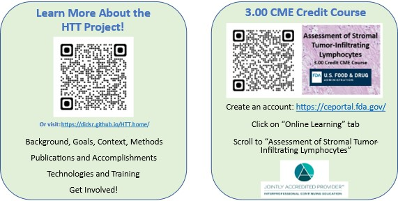
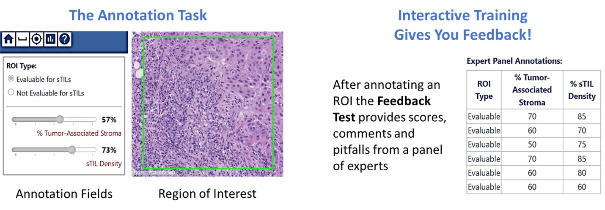

Greetings! Researchers from the [Office of Science and Engineering Laboratories, CDRH at the US FDA](https://www.fda.gov/about-fda/cdrh-offices/office-science-and-engineering-laboratories), alongside academic, clinical and industry colleagues, are collecting pathologist annotations of stromal tumor infiltrating lymphocytes (sTILs) as data for AI/ML algorithm validation. 

Volunteer pathologists will receive training in the task through a [continuing medical education course](../training-2023/cmeCourse.md) (3.00 CME credits) and [interactive training](../training-2023/interactiveTraining-gettingStarted.md) on our digital data-collection platform. After training, participants will be assigned pivotal study collections (30-60 min per collection) according to their interest and availability. Through your involvement, you will be generating the reference standard for algorithm validation ensuring high quality commercial products with a faster FDA-pipeline to approval.

**Questions?** Email the [project management team](../team.md)