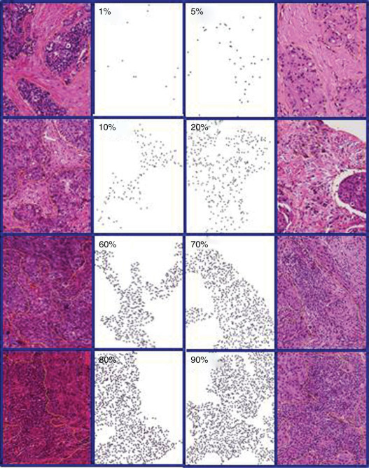

# Official CME course 
* [FDA CE portal](https://ceportal.fda.gov/)  
* Create an account.  
* Click on the "Online Learning" tab.  
* Scroll down to the course: "Assessment of Stromal Tumor-Infiltrating Lymphocytes"  

---
# Mirror of CME Course

## Description 
Tumor-infiltrating lymphocytes have been established as a prognostic biomarker in early-stage triple negative breast cancer. The assessment of the density of stromal tumor-infiltrating lymphocytes at the time of diagnosis may improve the accuracy of prognosis determination and inform therapeutic decision-making.

## Learning Objectives 
After completing the module, the participant should be able to:

* Describe the significance of stromal tumor infiltrating lymphocytes in triple negative breast cancer. 

* Demonstrate knowledge of the approach to determining the density of stromal tumor infiltrating lymphocytes.  

## Target Audience 
Physicians

---

## Course Content (3.00 CME credits)

1. Introduction to stromal tumor-infiltrating lymphocytes *(12min presentation)*

   * We discuss the immune systems' role in mediating tumor progression, and the statistics and literature that demonstrate how sTILs are prognostic biomarkers for patient outcomes and response to therapy in certain types of breast cancer.  
    
   * [Watch the video here.](https://vimeo.com/800001397)  

1. TILs Education: What are TILs and their Assessment *(8min tutorial video)*

    * Video description of the steps of the sTILs assessment.  
    
    * Presented by the International TILs Working Group: [Video.](https://www.youtube.com/watch?v=aPa-pXIBBlU)  

1. Pitfalls in the sTILs Assessment *(27min presentation)*

    * Discussion of example pitfalls encountered in the sTILs assessment.  
    
    * [Watch the video here.](https://vimeo.com/799870097)  

1. The evaluation of tumor-infiltrating lymphocytes (TILs) in breast cancer: recommendations by an International TILs Working Group 2014 *(30min publication)*

    * Salgado R, Denkert C, Demaria S, Sirtaine N, Klauschen F, Pruneri G, Wienert S, Van den Eynden G, Baehner FL, Penault-Llorca F, Perez EA, Thompson EA, Symmans WF, Richardson AL, Brock J, Criscitiello C, Bailey H, Ignatiadis M, Floris G, Sparano J, Kos Z, Nielsen T, Rimm DL, Allison KH, Reis-Filho JS, Loibl S, Sotiriou C, Viale G, Badve S, Adams S, Willard-Gallo K, Loi S; International TILs Working Group 2014. The evaluation of tumor-infiltrating lymphocytes (TILs) in breast cancer: recommendations by an International TILs Working Group 2014. Ann Oncol. 2015 Feb;26(2):259-71. [https://doi.org/10.1093/annonc/mdu450](https://www.doi.org/10.1038/s41523-020-0156-0). Epub 2014 Sep 11. PMID: 25214542; PMCID: PMC6267863.  

1. Post-Course Assessment 

    * Complete the post-course assessment.  

 
## Additional Information 

* [Salgado et al. (2015)](https://doi.org/10.1093/annonc/mdu450) created a visual reference sheet to help users calibrate their sTILs assessments:  

* 

* [sTILs reference document for the interactive Feedback test. ](./feedbackRefDoc.md)

* [Downloadable presentation slides for the videos](./pdfs/cmeCourseSlides-combined-final-20230217.pdf)
 
* Additional **interactive training** on sTILs assessment is available. [Click HERE.](./interactiveTraining-gettingStarted.md)

* For more information on the research project in which this course was developed (the High-Throughput Truthing project), please visit [What is HTT?](./../whatIsHTT.md)

* For more information on the sTILs assessment and to get involved with the International Immuno-Oncology Biomarker Working Group on Breast Cancer (the International TILS Working Group), please visit [https://www.tilsinbreastcancer.org/](https://www.tilsinbreastcancer.org/)

* This work was supported by the FDA Office of Women's Health. This project was supported in part by an appointment to the ORISE Research Participation Program at the Center for Drugs and Radiological Health, U.S. Food and Drug Administration, administered by the Oak Ridge Institute for Science and Education through an interagency agreement between the U.S. Department of Energy and FDA/Center. We also acknowledge the Pathology Department of Institut Jules Bordet in Brussels, Belgium for providing the pathology slides for this work.

* References from the *Activity Announcement with Additional Details* section of the CME course:

    * Kos, Z. et al. Pitfalls in assessing stromal tumor infiltrating lymphocytes (sTILs) in breast cancer. npj Breast Cancer 6, 17 (2020). [https://www.doi.org/10.1038/s41523-020-0156-0](https://www.doi.org/10.1038/s41523-020-0156-0)  
    
    * [What are TILs and why are they important?](https://www.tilsinbreastcancer.org/what-are-tils/)  

---

## The HTT Pivotal Study

* If you would like to proceed with collecting annotations for the HTT project's pivotal study, please [email your completion certificate to project organizers](../team.html).
